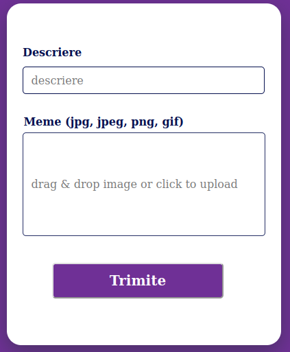

## IT Department: Tehnic Application

# Setup

Clone the repo and install the node_modules packages with:
>- <value>**npm install** or **yarn**</value>

Change the file **.env.example** file with **.env** and update it with the values that you are going to use.

To check the website go and use **npm/yarn run dev**. 

# How to run the project

Change the code from ./MongoDB_mongoose_postman_setup/routes/Author.tsx :

 

 

 To run the MongoDB/mongoose use **ts-node --esm ./src/MongoDB_mongoose_postman_setup/server.tsx** (or simply just put that command in package.json and add it as a script).

 Go to postman and let's create our first user:

 

And as you can see, the user has been created:

 

 To update the user's credentials grab the user's creation id and paste it into a patch call:

 

 And the updated credentials are:

 

 To delete a user make a call on /delete route and add the user's creation id to the postman:

 

 And now if you check the user with /get, you will notice that the user is gone:

 

# Things that haven't been touched in the MEME_IT project

The website should look something like this:

In case it doesn't look like that, it can be easily fixed with:
>- <value> @media only screen and (max-width: 1024px)

 Where 1024px is used for phone screens. This command should be added to the components that need size change (like images, header/main etc.) .

 To upload a meme you would need to be signed in your account.The schema for meme would have a new addition called **memes**, that would store an array of memes into the database:

 

 Popup would look something like the ImageUploader component, but with the right tabs for username, email and password:

 

 To make the popup_credentials appear when the user clicks on the **login/create account** buttons, we would need to set up a useState component, that would bring the props.children up to the screen. The **loging/create account**  buttons would have:

 >- <value> onChange={ () => { setState(true);
 >- <value> props.setTrigger(true) } }

 The popup-credentials would also have a **X** and send button that would close the popup and reset both the state and the props.setTrigger back to false.

 To valitdate the received data, the application verifies using ValidateSchema with some regex specific to each user's input:

 Regex for email and password ( with more than 8 characters):

 >- <value>Email:^([a-zA-Z0-9_\-\.]+)@([a-zA-Z0-9_\-\.]+)\.([a-zA-Z]{2,5})$
 >- <value>Password: ^.{8,}$

 For password encryption we would import the bcrypt package and use the hash() function to encrypt our password:

 >- <value>bcrypt.hash(password, 10).then((hashedPassword) => { console.log(hashedPassword); });

 To verify a password with the hashed password we would use compare() function:
 >- <value>bcrypt.compare(password, hashedPassword).then((result) => {
 >- <value>if (result) { console.log('The password is correct.'); } 
 >- <value>else { console.log('The password is incorrect.'); } });

 To create a jwt token we would use user's data:
>- <value>  const payload = {usernam, email, password };
>- <value>  const secret = 'mySecret'; const options = { expiresIn: '2h'};
>- <value>  const token = jwt.sign(payload, secret, options); console.log(token);

To decode the jwt we would use the verify function:
>- <value> try { const decoded = jwt.verify(token, secret); console.log(decoded); }
>- <value> catch (error) { console.log(error.message); }

# Extra features

1. Use yarn run format to format the whole code.

2. To run GraphQL use **npm/yarn ran** and then visit **:3002/graphql**, since :3001 it's used by MongoDB:

.

 That should show you a page for querying events in GraphQL for mySql database. Use mySql Workbench to connect to the database.